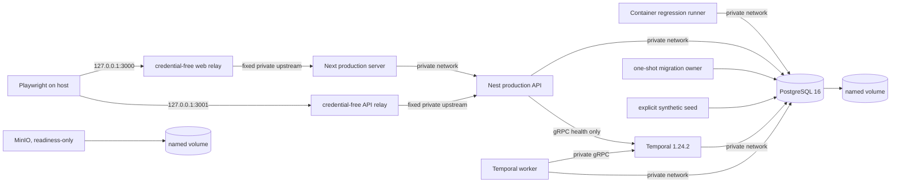

# Phase 15 Staging Security Gate

## Scope and verdict boundary

This document defines the reproducible, local/container staging proof in
`docker-compose.staging.yml`. It does not deploy VentureOS, expose it publicly,
select a cloud provider, validate a real provider, or establish production
readiness. All application processes run with `NODE_ENV=production`, while all
commercial/provider capabilities remain mock-only or disabled. Application
containers use an internal-only network. Two credential-free, fixed-target
ingress relays provide the only host bindings: the loopback ports required by
the local test runner.

## Architecture



`staging-private` is an isolated Docker network with `internal: true`. It has no
runtime route to the public Internet. PostgreSQL, Temporal, worker health,
MinIO, and the MinIO console have no host binding. API and web remain exclusively
on that network. Hardened relays with no application credentials join both
networks and forward only to fixed API/web upstreams for Docker Desktop loopback
publishing. The gate verifies that the API cannot reach a neutral external test
host. The local HTTP bindings model
the application behind a future TLS ingress; real staging must terminate HTTPS
before the web/API and must set the public origins and trusted proxy hop count
to the selected ingress topology.

## Runtime inventory

| Component              | Build artifact and start                                                    | Required environment                                                          | Health/readiness dependency                                                                                                               | Persistence                                              | Exposure and secrets                                     | Shutdown and staging limitation                                                                                                                                        |
| ---------------------- | --------------------------------------------------------------------------- | ----------------------------------------------------------------------------- | ----------------------------------------------------------------------------------------------------------------------------------------- | -------------------------------------------------------- | -------------------------------------------------------- | ---------------------------------------------------------------------------------------------------------------------------------------------------------------------- |
| API (`apps/api`)       | `Dockerfile.staging` target `api`; `/app/dist/main.js`; `node dist/main.js` | Complete staging contract below                                               | `/api/health/live` is process-only; `/api/health/ready` checks PostgreSQL, non-mutating Temporal gRPC health, and configured storage mode | Stateless; PostgreSQL is authoritative                   | private only; DB/auth/abuse secrets                      | SIGTERM/SIGINT closes Nest and logs start/completion; no TLS in the container                                                                                          |
| Web (`apps/web`)       | Next standalone artifact; `node apps/web/server.js`                         | build-time public API URL; runtime private API URL and cookie name            | production server must return `/login`; server components reach API privately; depends on healthy API                                     | Stateless                                                | private only; no server secret                           | Node/Next receives a 30-second grace period; local proof is HTTP only                                                                                                  |
| Ingress relays         | target `ingress`; `node staging-ingress-proxy.mjs`                          | fixed `INGRESS_TARGET` allowlist (`api` or `web`); no application credential  | relay health forwards to the corresponding private application health path                                                                | Stateless                                                | host `127.0.0.1:3000/3001`; loopback only                | non-root, read-only, capabilities dropped; not a TLS terminator or general-purpose proxy                                                                               |
| Worker (`apps/worker`) | target `worker`; `/app/dist/index.js`; `node dist/index.js`                 | DB, Temporal namespace/task queue, mock provider contract, worker health port | `/health/live` proves process; `/health/ready` becomes 200 only after connection, Worker creation, and run-loop entry                     | workflow state in Temporal; business state in PostgreSQL | health is private port 3002; DB/auth/provider config     | SIGTERM/SIGINT marks unready, requests Temporal shutdown, closes connection and health server; proof uses one worker                                                   |
| PostgreSQL             | `postgres:16-alpine`                                                        | generated synthetic user/password/database                                    | `pg_isready`                                                                                                                              | intentional named volume, removed by gate cleanup        | private network only; generated DB credential            | Compose stop; local volume is disposable, not a backup                                                                                                                 |
| Temporal server        | `temporalio/auto-setup:1.24.2`                                              | PostgreSQL connection                                                         | `tctl namespace list` against the container address                                                                                       | Temporal schemas/history in PostgreSQL volume            | private 7233 only; no Temporal credential in local proof | Compose stop; single-node auto-setup is not production architecture                                                                                                    |
| Temporal namespace     | one-shot `temporal-namespace` service                                       | `ventureos-staging`, three-day retention                                      | idempotent describe/register command after Temporal health                                                                                | stored in Temporal database                              | private                                                  | explicit orchestration step; managed-cloud auth/TLS untested                                                                                                           |
| MinIO                  | `minio/minio:RELEASE.2024-10-13T13-34-11Z`                                  | generated synthetic root credential                                           | MinIO live endpoint, used only to prove the disposable storage component starts                                                           | intentional named volume, removed by cleanup             | private 9000/9001 only                                   | application `STORAGE_PROVIDER=mock`, so API readiness and workflows never contact MinIO                                                                                |
| Migration owner        | `tools` image; `pnpm db:migrate` (`prisma migrate deploy`)                  | staging DB URL                                                                | must exit zero before seed/apps                                                                                                           | changes PostgreSQL schema                                | DB credential                                            | exactly one explicit one-shot invocation; API/worker never migrate                                                                                                     |
| Synthetic seed         | `tools` image; `pnpm db:seed`                                               | explicit founder fixture and all mock/false gates                             | runs only after migration                                                                                                                 | idempotent fixture rows                                  | generated founder credential                             | production runtime seeding fails unless the explicit mock-only staging seed boundary is complete; never automatic                                                      |
| Playwright/regressions | host Chromium for E2E; tools image for integration tests                    | generated disposable founder credential and loopback origins                  | API/web readiness                                                                                                                         | test artifacts only                                      | DB regressions stay private; E2E uses loopback           | canonical E2E plus complete integration regressions; disposable runner uses root only to write build/test outputs, with all capabilities dropped and no-new-privileges |
| Logging                | `StructuredLogger` JSON stdout                                              | `LOG_LEVEL`                                                                   | correlation middleware/interceptor                                                                                                        | container logs only                                      | redaction applied before output                          | no paid exporter, rotation, retention, or centralized alerting in local proof                                                                                          |

### Startup sequence and migration ownership

1. Generate `.staging/phase15.env` with random synthetic values. It is ignored by
   Git and removed during cleanup.
2. Build the `tools`, API, worker, web, and credential-free ingress targets from
   the repository root with pnpm 9.12.0 and a frozen lockfile.
3. Start healthy PostgreSQL, Temporal, and MinIO.
4. Register/verify `ventureos-staging` without a sleep.
5. Run the single migration job. A non-zero exit blocks every later step.
6. Run the explicit synthetic fixture seed.
7. Execute database-backed regression suites, then re-run the idempotent seed.
8. Start API and worker after database/Temporal health, web after API health,
   and the loopback relays after their fixed private upstreams are healthy.
9. Run readiness, nonmutation, E2E, restart, persistence, provider-hostname, and
   image-content checks.
10. Always collect logs and run `docker compose down --volumes --remove-orphans`.

Direct `docker compose up` is not the supported gate because it could omit the
explicit migration/seed sequence. Use `bash scripts/staging-security-gate.sh all`.

## Port map and network boundaries

| Port      | Binding                | Purpose                                                 |
| --------- | ---------------------- | ------------------------------------------------------- |
| 3000      | `127.0.0.1` only       | local web/E2E                                           |
| 3001      | `127.0.0.1` only       | local API/health/E2E                                    |
| 5432      | container network only | PostgreSQL                                              |
| 7233      | container network only | Temporal gRPC                                           |
| 3002      | container network only | worker health                                           |
| 9000/9001 | container network only | MinIO API/console                                       |
| 8088      | not present            | Temporal UI is intentionally omitted from staging proof |

No service binds `0.0.0.0` on the host. Backend dependencies and all application
containers are confined to the internal network. Credential-free relays join a
separate bridge only to publish the two loopback validation ports and can
forward only to fixed API/web upstreams. Deterministic mock modes, kill switches,
and a runtime egress-denial probe prevent provider use. Public staging requires
TLS at an ingress selected by the founder.

## Staging environment contract

The following names are required by the staging topology. Values are supplied
at runtime and are never committed:

- Runtime identity/origins: `NODE_ENV=production`,
  `DEPLOYMENT_ENVIRONMENT=staging`, `API_PUBLIC_ORIGIN`, `WEB_PUBLIC_ORIGIN`,
  `API_CORS_ORIGIN`, `API_TRUST_PROXY_HOPS`, `API_PORT`; web server components
  use `API_INTERNAL_BASE_URL=http://api:3001`, while browsers use the loopback
  public URL.
- Database: `DATABASE_URL`; Compose inputs `STAGING_POSTGRES_USER`,
  `STAGING_POSTGRES_PASSWORD`, `STAGING_POSTGRES_DB`.
- Authentication: `AUTH_SECRET`, `AUTH_ABUSE_DIGEST_SECRET`,
  `AUTH_COOKIE_NAME`, `DEV_LOGIN_ENABLED=false`. Production cookies are secure,
  HTTP-only, SameSite=Lax. Auth and abuse secrets must be distinct and must not
  match repository placeholder patterns.
- Temporal: `TEMPORAL_ADDRESS`, `TEMPORAL_NAMESPACE`, `TEMPORAL_TASK_QUEUE`,
  `WORKER_HEALTH_PORT`.
- Storage topology: `STORAGE_PROVIDER=mock`, explicit `MINIO_ENDPOINT`,
  `MINIO_PORT`, `MINIO_ROOT_USER`, `MINIO_ROOT_PASSWORD`, `MINIO_BUCKET`, and
  `MINIO_USE_SSL=false`. These endpoint values exist for topology inventory;
  mock readiness returns without constructing or contacting a MinIO client.
- Providers: `AI_PROVIDER=mock`, `MARKETPLACE_ETSY_MODE=mock`; no Anthropic,
  marketplace, advertising, paid-integration, notification, payment, or email
  credential may be set.
- Kill switches: `FEATURE_LIVE_PUBLISHING_ENABLED=false`,
  `FEATURE_STORAGE_UPLOADS_ENABLED=false`, `FEATURE_ADVERTISING_ENABLED=false`,
  `FEATURE_PAID_INTEGRATIONS_ENABLED=false`, `OTEL_ENABLED=false`.
- Explicit seed only: `STAGING_SEED_ENABLED=true`, generated founder fixture
  names, and the complete mock/false boundary above. Missing any element causes
  production-mode seed refusal.

`packages/config/src/env.ts` enforces the production/staging constraints at
startup. Missing origins, enabled development login, duplicate/placeholder
secrets, real provider selections, live credentials, or enabled live/paid
switches fail closed.

## Staging threat assessment

| Threat                               | Classification                                                       | Control/evidence or remaining action                                                                                                                       |
| ------------------------------------ | -------------------------------------------------------------------- | ---------------------------------------------------------------------------------------------------------------------------------------------------------- |
| Accidental real-provider contact     | blocked by design + validated                                        | mock-only schema contract, all switches false, internal app network, credential-free fixed relays, runtime egress-denial probe, provider hostname log scan |
| Secret leakage                       | validated locally                                                    | generated ignored file, no values in Compose/docs, logger redaction, image and Git scans; centralized secret manager remains required                      |
| Public database or Temporal exposure | blocked by design                                                    | database and Temporal have no host binding; real staging firewall/security groups required                                                                 |
| Insecure object storage exposure     | blocked by design                                                    | MinIO has no host binding and application storage mode is mock                                                                                             |
| Missing TLS                          | staging operational control required; production blocker             | local loopback proof uses HTTP; real staging must terminate trusted HTTPS                                                                                  |
| Permissive CORS                      | validated                                                            | one exact origin; staging schema requires CORS to equal web origin                                                                                         |
| Trusted-proxy misconfiguration       | staging operational control required                                 | local proof explicitly uses zero hops; founder-selected ingress requires exact reviewed hop count                                                          |
| Weak session cookies                 | validated locally                                                    | production mode sets Secure, HttpOnly, SameSite=Lax; HTTPS ingress still required                                                                          |
| Cross-workspace access               | validated by existing unit/integration suites                        | tenant filters and permission guards remain mandatory regression gates                                                                                     |
| Unsafe development login             | blocked by design                                                    | staging schema rejects `DEV_LOGIN_ENABLED=true`; synthetic seed login is explicit fixture data                                                             |
| Default credentials                  | blocked by design                                                    | generated random values and placeholder rejection; no Compose fallback                                                                                     |
| Migration races                      | blocked by design                                                    | one explicit migration owner before API/worker; applications never migrate                                                                                 |
| Multiple worker instances            | staging operational control required                                 | proof intentionally runs one worker; scaling needs workflow/activity idempotency and poller monitoring review                                              |
| Stale queued work                    | validated for restart without mutation; operational control required | Temporal volume survives app restart; cleanup removes disposable state; real staging needs retention/drain policy                                          |
| Replay and duplicate execution       | validated by regression suite                                        | research/marketplace replay and idempotency tests run against disposable DB                                                                                |
| Unbounded logs                       | staging operational control required; production blocker             | JSON stdout exists; real staging needs size/retention/rate controls                                                                                        |
| Missing backups                      | production blocker                                                   | local volumes are disposable; no automated backup or restore rehearsal                                                                                     |
| Insecure GitHub Actions permissions  | validated                                                            | staging CI retains `contents: read` only, no deployment permission or credential                                                                           |
| Environment drift                    | blocked by contract + operational control                            | Compose and Zod contract are versioned; cloud IaC/config comparison remains required                                                                       |
| Production credential reuse          | blocked by design + operational control                              | generator creates isolated synthetic values; real staging secret manager must use separate secret objects and rotation                                     |

## Names-only staging secret manifest

| Secret name                                                               | Purpose                               | Owner                    | Consumer                                        | Rotation and separation                                               | Startup failure/removal                            |
| ------------------------------------------------------------------------- | ------------------------------------- | ------------------------ | ----------------------------------------------- | --------------------------------------------------------------------- | -------------------------------------------------- |
| `STAGING_DATABASE_USERNAME` / `STAGING_DATABASE_PASSWORD`                 | application database authentication   | platform operator        | PostgreSQL, migration, API, worker, backup jobs | unique per environment; rotate on compromise and scheduled policy     | fail startup; retained                             |
| `STAGING_AUTH_SECRET`                                                     | session/auth cryptographic secret     | security owner           | API                                             | unique from production and abuse secret; planned coordinated rotation | fail startup; retained                             |
| `STAGING_AUTH_ABUSE_DIGEST_SECRET`                                        | pseudonymous abuse bucket digest      | security owner           | API                                             | unique from auth/production; rotation resets abuse buckets            | fail startup; retained                             |
| `STAGING_ENCRYPTION_KEY`                                                  | future at-rest application encryption | security owner           | future credential/token store                   | unique per environment; versioned rotation                            | fail when encrypted feature exists; retained       |
| `STAGING_FOUNDER_BOOTSTRAP_EMAIL` / `STAGING_FOUNDER_BOOTSTRAP_PASSWORD`  | one-time initial staging founder      | founder                  | explicit bootstrap/seed job                     | one-time, staging-only, rotate immediately after initialization       | fail bootstrap; password removable after bootstrap |
| `STAGING_OBJECT_STORAGE_ACCESS_KEY` / `STAGING_OBJECT_STORAGE_SECRET_KEY` | object storage authentication         | platform operator        | MinIO/S3 adapter and backup job                 | unique per environment; regular rotation                              | fail when storage mode requires it; retained       |
| `STAGING_TEMPORAL_CLIENT_CERT` / `STAGING_TEMPORAL_CLIENT_KEY`            | future managed Temporal mTLS          | platform operator        | API/worker/operations                           | unique per environment; rotate before expiry                          | fail when managed Temporal selected; retained      |
| `STAGING_GITHUB_DEPLOYMENT_CREDENTIAL`                                    | future authenticated deployment only  | founder/repository admin | future deployment workflow                      | staging-only, least privilege, short-lived/OIDC preferred             | not used now; removable if OIDC is selected        |

The local proof generates only the secrets currently consumed. It creates no
cloud secret and commits no value.

## Health, logging, metrics, and alerts

Public API health responses expose only component `ok`/`down` state and a
timestamp. They do not expose addresses, credentials, exceptions, namespaces,
task queues, or stack traces. Repeated Temporal health checks are compared
against workflow-list state. Mock storage readiness returns immediately and
never contacts MinIO. Worker readiness is private and reports only `ok`/`down`.

Application logs are JSON with service, timestamp, level, message, correlation
ID where request-scoped, and redacted fields. Public exception filtering remains
generic. Real staging must collect without provider payloads, passwords,
tokens, cookies, license keys, raw tenant identifiers, or unbounded stack
traces.

Minimum real-staging metrics/alerts:

- API and web availability/error rate/latency; worker process availability.
- Temporal task failures, retry exhaustion, queue latency, and poller count.
- PostgreSQL connection saturation, storage/disk capacity, and migration failure.
- Authentication throttle/cooldown rates without raw identifiers.
- Stable policy denial reason-code counts and provider kill-switch state.
- Publication attempts, cost-cap blocks, and any non-mock provider selection.
- Backup age, backup failure, restore-drill age, certificate expiry, and secret
  rotation age.

No paid telemetry provider is connected by this phase.

## Backup, restore, rollback, and persistence

The local gate proves PostgreSQL data survives API/worker restart and that
Temporal remains available over the same disposable database volume. Cleanup
intentionally deletes both named volumes; this is not backup evidence.

Before real staging, select and implement encrypted PostgreSQL backups with an
explicit RPO/RTO, retention policy, off-host copy, restore rehearsal, and access
audit. Object storage needs versioning/replication or an independent mirror.
Temporal persistence shares the local PostgreSQL instance only for this proof;
managed/self-hosted staging needs a supported backup/restore design coordinated
with Temporal versioning. A restore drill must stop API/worker, restore to a
fresh target, run migration status checks (not destructive reset), start one
worker, and verify readiness and workflow visibility.

Application rollback is image-based: retain the previous immutable image digest,
remove the new API/worker/web from traffic, and start the previous images against
a schema proven backward-compatible. Database migrations are forward-only;
never run `prisma migrate reset`. Any non-backward-compatible migration requires
founder-approved backup, restore rehearsal, maintenance window, and a separate
rollback migration/data plan before deployment.

## Commands

```text
node scripts/generate-staging-env.mjs
bash scripts/staging-security-gate.sh build
bash scripts/staging-security-gate.sh up
bash scripts/staging-security-gate.sh logs
bash scripts/staging-security-gate.sh down
bash scripts/staging-security-gate.sh all
```

`all` begins from empty Phase 15 volumes, validates the topology, restarts API
and worker, repeats E2E on reused state, captures `.staging/topology.log`, and
tears down unconditionally. The generated environment file is removed. To
troubleshoot, inspect the captured log, `docker compose ... ps`, individual
health status, migration job exit, and loopback port ownership. Never substitute
a real credential or enable egress to diagnose the mock proof.

## Cloud resources still requiring founder selection

No provider is selected or purchased. A later staging deployment requires a
founder decision on:

1. Region/jurisdiction and cloud/VPS or managed-container provider.
2. Private network, subnets, firewall/security groups, NAT/egress policy, and
   ingress/load balancer with managed TLS certificate.
3. Managed PostgreSQL or self-hosted HA PostgreSQL, sizing, encrypted storage,
   backup/PITR, retention, RPO/RTO, and restore-drill location.
4. Temporal Cloud with mTLS/API namespace or a supported self-hosted Temporal
   cluster, persistence database, visibility store, encryption, and monitoring.
5. S3-compatible object storage, private bucket policy, versioning, encryption,
   lifecycle, capacity alerts, malware-scan integration, and backup strategy.
6. Container registry with immutable digests, vulnerability scanning,
   retention, and least-privilege pull identity.
7. Secret manager and workload identity/OIDC; no long-lived GitHub deployment
   token is preferred.
8. DNS name (not authorized now), TLS ingress, exact trusted proxy hops, CORS
   origin, rate limits, and optional WAF.
9. Central JSON log/metric/alert service and on-call destination within budget.
10. CI deployment environment/protection rules only after a separate founder
    authorization; this phase adds no deployment job.

## Limitations

This is local Docker Desktop/container evidence on one Windows host plus Linux
containers. It is not cloud evidence, public ingress/TLS evidence, host/OS
isolation evidence, high availability, multi-worker scale, backup/restore,
chaos, load, penetration, or real-provider validation. No marketplace action,
paid AI call, payment, advertisement, email, notification, or public
publication is enabled. Passing this gate must never be described as production
ready or commercial-launch ready.
